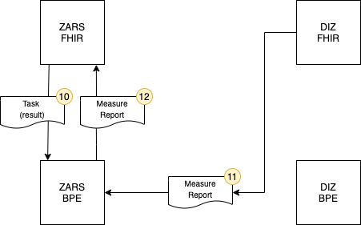
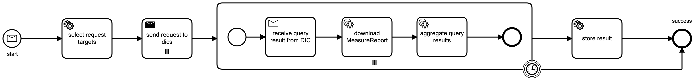
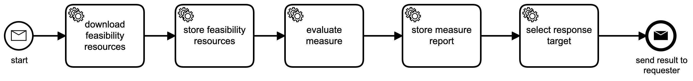

# NUM CODEX Feasibility Process

A distributed feasibility query runs based on the feasibility process. A feasibility query contains multiple criteria and returns one population count per organization. An organization (usually the Zentrale Antrags- und Registerstelle (ZARS)) requests a feasibility query to start off the process. Once started multiple organizations (usually Datenintegrationszentren (DIZ)) execute this query and report results back.

## High-Level Overview

As you can see in the figure above, the feasibility query process starts with a `request` message (1) that the ZARS or any other initiating organization sends to itself. By sending this message to the ZARS itself, the Business Process Engine (BPE) of the ZARS can be used to distribute the `execute` messages (2) to all DIZ'es in question. After receiving the `execute` messages, each DIZ will calculate the result and answer with a `result` message (3). The ZARS will accumulate the results and provide the requester with live updates.

## Request and Execute Process in Detail

### Distribute Query

Messages, queries and results are represented by FHIR resources. The following three figures show the entire FHIR resource flow. In difference to the figure above, only one DIZ is represented, but both, the ZARS and the DIZ are divided into its individual components. On the ZARS side the components are the FHIR communication server and the BPE, were the DIZ contains an additional Blaze FHIR server.

1. Like in the high-level overview, the process starts with the `request` message. Beside the FHIR [Task][1] resource for the message, two other FHIR resources will be sent to the ZARS FHIR server. The first one is the [Measure][2] resource specifying the population criteria that are defined in the second resource, the [Library][3]. All three resources are put into a transaction [Bundle][4] in order to create all together in one transaction.

1. After the ZARS FHIR server receives the resources, it notifies the ZARS BPE via websocket subscription by transmitting the Task resource. The incoming Task resource starts the `request` process that implements the query distribution to all appropriate DIZ'es. 
   
### Execute Query

3. To each DIZ, an `execute` message is sent via a Task resource.

3. After arriving at the DIZ FHIR communication server, the `execute` Task resource is transferred to the DIZ BPE via websocket subscription, starting the `execute` process.

5. In each DIZ, the `execute` process starts by fetching the Measure and Library resource created at the ZARS FHIR communication server. The resources have to be fetched by the BPE because only Task resources are sent actively between organizations and message payload is only fetched in case a process really needs it. FHIR search is used in order to fetch both resources in one HTTP request by searching for the Measure resource and including the referenced Library resource.

5. In the next step, the `execute` process stores the Measure and Library resources to the Blaze FHIR server in order to be able to execute the [$evaluate-measure][5] operation. 
   
5. The resulting [MeasureReport][6] resource is transferred back to the DIZ BPE.

5. After receiving the MeasureReport, the DIZ BPE stores it on the DIZ FHIR communication server in order to make it available for the ZARS.

### Retrieve Results

9. In its last step, the `execute` process sends a `result` message to the ZARS. The `result` message references the MeasureReport, so that it can be retrieved by the ZARS.

10. After arrival, the ZARS FHIR communication server will send the `result` Task resource to the ZARS BPE via websocket subscription. The incoming `result` message will use its correlation ID to match the original `request` process to continue. 
    
10. As part of this process, the MeasureReport resource is fetched from the DIZ.

10. The fetched MeasureReport resource is stored immediately on the ZARS FHIR communication server together with the updated Task resource. The Task resource references the MeasureReport resource in its output parameter, in order to make it available to the initial requester.

## Request Process as BPMN Model

In the [Business Process Model and Notation][7] (BPMN) model of the `request` process, the start message is the `request` message. After selecting the request targets (the DIZ'es), the `execute` messages are send in the next step. After that a subprocess is started for each target, which will wait for the `result` message to arrive. After the result message of each DIZ is stored immediately, the results are aggregated. After Subprocess the task resource is prepared for further evaluation.

## Execute Process as BPMN Model

The BPMN model of the `execute` process is straightforward and already explained in detail above.

[1]: <https://www.hl7.org/FHIR/task.html>
[2]: <https://www.hl7.org/fhir/measure.html>
[3]: <https://www.hl7.org/fhir/library.html>
[4]: <https://www.hl7.org/fhir/bundle.html>
[5]: <https://www.hl7.org/fhir/operation-measure-evaluate-measure.html>
[6]: <https://www.hl7.org/fhir/measurereport.html>
[7]: <https://en.wikipedia.org/wiki/Business_Process_Model_and_Notation>
