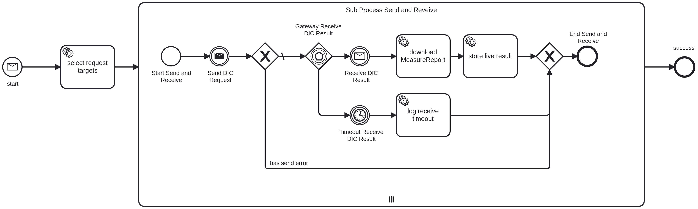
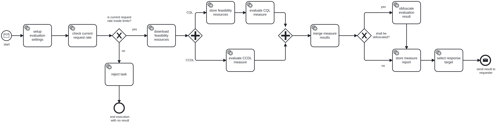

# Feasibility DSF Process/

A distributed feasibility query runs based on the feasibility process. A feasibility query contains multiple criteria and returns one population count per organization. An organization (usually the Zentrale Antrags- und Registerstelle (ZARS)) requests a feasibility query to start off the process. Once started multiple organizations (usually Datenintegrationszentren (DIZ)) execute this query and report results back.

## High-Level Overview


As you can see in the figure above, the feasibility query process starts with a `request` message (1) that the ZARS or any other initiating organization sends to itself. By sending this message to the ZARS itself, the Business Process Engine (BPE) of the ZARS can be used to distribute the `execute` messages (2) to all DIZ'es in question. After receiving the `execute` messages, each DIZ will calculate the result and answer with a `result` message (3). The ZARS will accumulate the results and provide the requester with live updates.

## Request and Execute Process in Detail

### Distribute Query

Messages, queries and results are represented by FHIR resources. The following three figures show the entire FHIR
resource flow. In contrast to the figure above, only one DIZ is represented, but both, the ZARS and the DIZ are divided
into its individual components. On the ZARS side the components are the FHIR communication server and the BPE, were the
DIZ contains an additional Blaze FHIR server.


1. Like in the high-level overview, the process starts with the `request` message. Beside the FHIR [Task][1] resource
   for the message, two other FHIR resources will be sent to the ZARS FHIR server. The first one is the [Measure][2]
   resource specifying the population criteria that are defined in the second resource, the [Library][3]. All three
   resources are put into a transaction [Bundle][4] in order to create all together in one transaction.

2. After the ZARS FHIR server receives the resources, it notifies the ZARS BPE via websocket subscription by
   transmitting the Task resource. The incoming Task resource starts the `request` process that implements the query
   distribution to all appropriate DIZ'es.

3. To each DIZ, an `execute` message is sent via a Task resource.

4. After arriving at the DIZ FHIR communication server, the `execute` Task resource is transferred to the DIZ BPE via
   websocket subscription, starting the `execute` process.

### Execute Query (CQL)

This describes the execute process in case `CQL` is specified as an evaluation strategy.


5. In each DIZ, the `execute` process starts by fetching the Measure and Library resource created at the ZARS FHIR
   communication server. The resources have to be fetched by the BPE because only Task resources are sent actively
   between organizations and message payload is only fetched in case a process really needs it. FHIR search is used in
   order to fetch both resources in one HTTP request by searching for the Measure resource and including the referenced
   Library resource.

6. In the next step, the `execute` process stores the Measure and Library resources to each configured FHIR server in
   order to be able to execute the [$evaluate-measure][5] operation.

7. The resulting [MeasureReport][6] resources are transferred back to the DIZ BPE.

8. After receiving the MeasureReports, the DIZ BPE extracts the population counts from the MeasureReports and passes it
   the sum to the next step.

### Execute Query (CCDL)

This describes the execute process in case `CCDL` is specified as an evaluation strategy.


5. In each DIZ, the `execute` process starts by checking the current request rate against the configured rate limit and
   rejects the current and all future requests when the rate limit is exceeded until the BPE is restarted. If the rate
   limit has not been exceeded the process continues by fetching the Measure and Library resource created at the ZARS
   FHIR communication server. The resources have to be fetched by the BPE because only Task resources are sent actively
   between organizations and message payload is only fetched in case a process really needs it. FHIR search is used in
   order to fetch both resources in one HTTP request by searching for the Measure resource and including the referenced
   Library resource.

6. The DIZ BPE extracts the CCDL query from the Library resource and sends it to each configured Flare server.

7. The DIZ Flare servers run the evaluation by transforming the CCDL query into one or more requests compatible with the
   FHIR standard.

8. Each DIZ Flare server collects all results from the FHIR server and sends back a single population count to the BPE.

10. The DIZ BPE send the sum of all population counts to the next step.

### Merging Results

11. The population counts of the FHIR and Flare stores get summed up to a single result count. Based on the result count
    and the resources it downloaded in `5.` a MeasureReport is created. Additionally, it obfuscates the result count
    unless disabled. The DIZ BPE stores this MeasureReport on the DIZ FHIR communication server in order to make it
    available for the ZARS.

12. In its last step, the `execute` process sends a `result` message to the ZARS. The `result` message references the
    MeasureReport, so that it can be retrieved by the ZARS.

### Retrieve Results


10. After arrival, the ZARS FHIR communication server will send the `result` Task resource to the ZARS BPE via websocket subscription. The incoming `result` message will use its correlation ID to match the original `request` process to continue.

11. As part of this process, the MeasureReport resource is fetched from the DIZ.

12. The fetched MeasureReport resource is stored immediately on the ZARS FHIR communication server together with the updated Task resource. The Task resource references the MeasureReport resource in its output parameter, in order to make it available to the initial requester.

## Supported Query Types

This process supports the following query types within the transferred Library resource:

| Type              | Description                                                                                                                                                     | Mime Type                  |
|-------------------|-----------------------------------------------------------------------------------------------------------------------------------------------------------------|----------------------------|
| CQL               | Standardized query format. See https://cql.hl7.org/ for more information.                                                                                       | `text/cql`                 |
| CCDL              | Internal query representation as defined in [this project](https://github.com/medizininformatik-initiative/clinical-cohort-definition-language) in JSON format. | `application/sq+json`      |
| FHIR Search Query | Standardized FHIR search query. See https://www.hl7.org/fhir/search.html for more information.                                                                  | `application/x-fhir-query` |

> [!NOTE]
> Although a FHIR search query can be transferred to the process no result will be calculated!

## Result Obfuscation

The process ensures obfuscation of a DIZ's real evaluation numbers by rounding them to the nearest ten. Real numbers are solely present in an intermediary step for obfuscation purposes. None of these non obfuscated numbers get persisted unless obfuscation gets explicitly disabled.

## Request Process as BPMN Model



In the [Business Process Model and Notation][7] (BPMN) model of the `request` process, the start message is the `request` message. After selecting the request targets (the DIZ'es), the `execute` messages are send in the next step. After that a subprocess is started for each target, which will wait for the `result` message to arrive. After the result message of each DIZ is stored immediately, the results are aggregated. After Subprocess the task resource is prepared for further evaluation.

## Execute Process as BPMN Model



The BPMN model of the `execute` process is straightforward and already explained in detail above.

## Configuration

The feasibility plugin needs configuration for the execute process, which should only be activated by organization with
the role *DIC* in their parent organization(s). This configuration consists of environment variables and a configuration
file in YAML format.

### BPE Process Exclusion

Depending on the DSF role(s) of your organization, you may exclude one of the two feasibility processes.

> [!NOTE]
> If your organization has the roles **DIC** and **HRP** in the same or different parent organizations you need both
> processes, hence do **not** exclude any of them.

Modify the process exclude config in `/opt/bpe/docker-compose.yml`
    - **DIC only:**
    ```yaml
           DEV_DSF_BPE_PROCESS_EXCLUDED: |
             medizininformatik-initiativede_feasibilityRequest|1.1
    ```
    - **HRP only:**
    ```yaml
           DEV_DSF_BPE_PROCESS_EXCLUDED: |
             medizininformatik-initiativede_feasibilityExecute|1.1
    ```

    _Additional processes may be listed in your process exclude config._

### Environment Variables

Besides the [common DSF settings controlled by different environment variables][8], there are additional specific to this process.

> [!NOTE]
> All of them share the same prefix `DE_MEDIZININFORMATIK_INITIATIVE_FEASIBILITY_DSF_PROCESS_`.

| EnvVar                                  | Description                                                                                                                                                                    | Default  |
|-----------------------------------------|--------------------------------------------------------------------------------------------------------------------------------------------------------------------------------|----------|
| CONFIGURATION                           | The YAML formatted configuration configuring the stores for the parent organization(s) for executing feasibility queries.                                                      | `null`   |
| CONFIGURATION_FILE                      | Sets the path to the configuration YAML file configuring the stores for the parent organization(s) for executing feasibility queries.                                          | `null`   |

The above environment variables are both exclusive, meaning that only one of them are setting the effective
configuration. If both have a non-empty value the environment variable `CONFIGURATION` takes precedence.

### Configuration

The configuration is a YAML formatted text containing the configuration for the FHIR store(s) which will be used for
executing feasibility queries. It is separated into 2 main parts:

  * the section `stores` configures the access to the FHIR store(s) including the evaluation strategy to be used, the base
    URL and authentication options.
  * the section `networks` sets the stores, whether results should be obfuscated or not and the request rate limit for
    each parent organization the local organization is part of and has the role *DIC*.

> [!IMPORTANT]
> To use the configuration file, it must be accessible by the BPE process where the feasibility process plugin is
> deployed. If you're using Docker, ensure the file is mounted inside the BPE Docker container. Configure the path to
> this file for the feasibility process plugin using the environment variable specified in the **Environment Variables**
> section.

The following code block shows the configuration structure with all available options including descriptions and the
relation to the now unsupported environment variables used in versions before 1.1.0.0:

```yaml
stores:

  # A self chosen unique id for the store configuration referenced in the section 'networks' below.
  my-store-1:

    # Defines whether the feasibility shall be evaluated using `cql` or `ccdl` (previously called `structured-query`).
    # Using the latter requires a FLARE instance.
    evaluationStrategy: ccdl  # env: EVALUATION_STRATEGY

    # Base URL to a FHIR server or proxy for feasibility evaluation.
    # This can also be the base URL of a reverse proxy if used.
    baseUrl: https://foo.store  # env: CLIENT_STORE_BASE_URL

    # Timeout for a blocking read / write network operation to a FHIR server without failing in ms.
    # Defaults to 300000 ms (= 5 minutes).
    requestTimeout: 20000  # env: CLIENT_STORE_TIMEOUT_SOCKET

    # Path to a PEM certificate file containing trusted CA certificates used for connecting to a FHIR server.
    # Necessary when using self-signed certificates.
    # NOTE: trusted certificates have to be provided as a single PEM file containing the concatenated certificates.
    #       Before version 1.0.1.0 it had to be provided in the PKCS#12 format (.p12).
    trustedCACertificates: /path/to/trusted-cas.pem  # env: CLIENT_STORE_TRUST_STORE_PATH

    # Username and password for basic authentication against a FHIR server client target.
    # 'password' and 'passwordFile' are mutual exclusive.
    basicAuth:
      username: foo                                   # env: CLIENT_STORE_AUTH_BASIC_USERNAME
      password: B4r                                   # env: CLIENT_STORE_AUTH_BASIC_PASSWORD
      passwordFile: /path/to/basic/auth/password.txt  # env: CLIENT_STORE_AUTH_BASIC_PASSWORD

    # Bearer token used for authentication against a client target. Do not prefix this with `Bearer `!
    # 'token' and 'tokenFile' are mutual exclusive.
    bearerAuth:
      token: S3cr3tT0k3n                         # env: CLIENT_STORE_AUTH_BEARER_TOKEN
      tokenFile: /path/to/bearer/auth/token.txt  # env: CLIENT_STORE_AUTH_BEARER_TOKEN

    # Authentication against a OpenID Connect provider to gain access token for FHIR server client target.
    # 'clientPassword' and 'clientPasswordFile' are mutual exclusive.
    oAuth:
      issuerUrl: https://issuer.example/                # env: CLIENT_STORE_AUTH_OAUTH_ISSUER_URL
      clientId: foo                                     # env: CLIENT_STORE_AUTH_OAUTH_CLIENT_ID
      clientPassword: bar                               # env: CLIENT_STORE_AUTH_OAUTH_CLIENT_PASSWORD
      clientPasswordFile: /path/to/client/password.txt  # env: CLIENT_STORE_AUTH_OAUTH_CLIENT_PASSWORD
      # Forward proxy to be used to connect to the OpenID Connect provider.
      # 'username' and 'password' are optional.
      # 'password' and 'passwordFile' are mutual exclusive.
      proxy:
        host: proxy.foo                                  # env: CLIENT_STORE_AUTH_OAUTH_PROXY_HOST
        port: 1234                                       # env: CLIENT_STORE_AUTH_OAUTH_PROXY_PORT
        username: foo                                    # env: CLIENT_STORE_AUTH_OAUTH_PROXY_USERNAME
        password: B4r                                    # env: CLIENT_STORE_AUTH_OAUTH_PROXY_PASSWORD
        passwordFile: /path/to/oauth/proxy/password.txt  # env: CLIENT_STORE_AUTH_OAUTH_PROXY_PASSWORD
    # Forward proxy to connect to FHIR server.
    # 'username', 'password' and 'passwordFile' are optional.
    # 'password' and 'passwordFile' are mutual exclusive.
    proxy:
      host: proxy.bar                            # env: CLIENT_STORE_PROXY_HOST
      port: 4321                                 # env: CLIENT_STORE_PROXY_PORT
      username: foo                              # env: CLIENT_STORE_PROXY_USERNAME
      password: B4r                              # env: CLIENT_STORE_PROXY_PASSWORD
      passwordFile: /path/to/proxy/password.txt  # env: CLIENT_STORE_PROXY_PASSWORD

    # Path to a client certificate PEM file used for authenticating against a FHIR server or proxy.
    # NOTE: The client certificate and the private key are now needed to be provided as PEM files.
    #       Before version 1.0.1.0 it had to be provided in the PKCS#12 format (.p12)
    clientCertificate: /path/to/client-cert.pem                # env: CLIENT_STORE_KEY_STORE_PATH
    privateKey: /path/to/private-key.pem                       # env: CLIENT_STORE_KEY_STORE_PATH
    privateKeyPassword: fooB4r                                 # env: CLIENT_STORE_KEY_STORE_PASSWORD
    privateKeyPasswordFile: /path/to/private/key/password.txt  # env: CLIENT_STORE_KEY_STORE_PASSWORD

networks:
  # Each parent organization is identified by the same organization identifier as used in the allow list of the DSF.
  medizininformatik-initiative.de:

    # Defines whether the feasibility evaluation result shall be obfuscated.
    # Defaults to 'true'.
    obfuscate: true  # env: EVALUATION_OBFUSCATE

    # Sets the hard limit for the maximum allowed number of requests during the configured rate limit interval after no
    # further requests will be processed.
    # The duration is required to be given in the ISO 8601 format, e.g. "PT1H30M10S" (see
    # https://en.wikipedia.org/wiki/ISO_8601#Durations).
    # Defaults to 999 requests per hour.
    rateLimit:
      count: 500      # env: RATE_LIMIT_COUNT
      interval: PT2H  # env: RATE_LIMIT_INTERVAL_DURATION

    # Sets the FHIR store(s) to be used for executing feasibility queries. Results of multiple stores are summed up to
    # a single count.
    # Each id corresponds to an id given to a store configuration in the section 'stores' above.
    stores:
    - my-store-1
```

> [!IMPORTANT]
> In the `stores` section, each store configuration can use only **one** of the following authentication methods:
> `basicAuth`, `bearerAuth`, or `oAuth`. A client certificate can either be combined with any of these methods or used
> on its own.

Below is an example configuration for 2 parent organizations and 2 FHIR stores. The stores use TLS encrypted
communication with a self-signed server certificate. One store requires OpenID Connect authentication and CCDL queries,
while the other uses a client certificate and CQL queries. Note that one of the stores and the OpenID Connect provider
are only accessible via a forward proxy with basic authentication:

```yaml
stores:
  my-production-store:
    baseUrl: https://store.my-organization.de
    evaluationStrategy: ccdl
    requestTimeout: 20000
    trustedCACertificates: /opt/bpe/trusted-cas.pem
    oAuth:
      issuerUrl: https://issuer.internal/realm/foo
      clientId: foo
      clientPassword: F00B4r
      proxy:
        host: proxy.internal
        port: 1234
        username: foo
        passwordFile: /opt/bpe/proxy.password

  my-extra-store:
    baseUrl: https://non-public-store.internal/fhir
    evaluationStrategy: cql
    requestTimeout: 5000
    trustedCACertificates: /opt/bpe/trusted-cas.pem
    clientCertificate: /opt/bpe/client-cert.pem
    privateKey: /opt/bpe/private-key.pem
    privateKeyPasswordFile: /opt/bpe/private-key.password
    proxy:
      host: proxy.internal
      port: 1234
      username: foo
      passwordFile: /opt/bpe/proxy.password

networks:
  medizininformatik-initiative.de:
    obfuscate: true
    rateLimit:
      count: 100
      interval: PT1H
    stores:
    - my-production-store

  my.parent-organization.example.com:
    obfuscate: false
    rateLimit:
      count: 1000
      interval: PT1S
    stores:
    - my-production-store
    - my-extra-store
```

#### Environment Variable Substitution

The YAML configuration may contain custom environment variables which will be replaced if an environment variable of the
same name is found. If no environment variable of the same name is found, no substitution will be done.
The format for enviromnent variables inside the YAML configuration to be recognized as such is by wrapping the variable
name with `${}`, e. g. by setting a value for the environment variable `BASE_URL` all occurences of the text
`${BASE_URL}` in the configuration YAML will be substituted with the value. The following configuration snippet shows
the usage:

```yaml
stores:
  my-store-1:
    baseUrl: ${BASE_URL}
    evaluationStrategy: cql
```

Nested environment variables are supported. For example, by setting the environment variable `STORE_ID_1` to `foo` and
`BASE_URL_foo` to `http://foo.bar`, you can use nested variable substitution. The following snippet demonstrates this:

```yaml
stores:
  ${STORE_ID_1}:
    baseUrl: ${BASE_URL_${STORE_ID_1}} # First replaced by '${BASE_URL_foo}' and finally by 'http://foo.bar'
```

> [!NOTE]
> It is recommended to add an unique prefix to your custom environment variable names to prevent conflicts with existing
> system and application environment variables.

## Compatibility

This version of the process is compatible with the following components:

| Component | Compatible Version(s) |
|-----------|-----------------------|
| DSF FHIR  | `>= 1.6.0`            |
| DSF BPE   | `>= 1.6.0`            |
| Blaze     | `>= 0.28`             |
| Flare     | `>= 2.4.0`            |

> [!NOTE]
> Flare got rewritten. Only the [new project][9] is supported.


[1]: <https://www.hl7.org/FHIR/task.html>
[2]: <https://www.hl7.org/fhir/measure.html>
[3]: <https://www.hl7.org/fhir/library.html>
[4]: <https://www.hl7.org/fhir/bundle.html>
[5]: <https://www.hl7.org/fhir/operation-measure-evaluate-measure.html>
[6]: <https://www.hl7.org/fhir/measurereport.html>
[7]: <https://en.wikipedia.org/wiki/Business_Process_Model_and_Notation>
[8]: <https://dsf.dev/stable/maintain/bpe/configuration.html>
[9]: <https://github.com/medizininformatik-initiative/flare>
